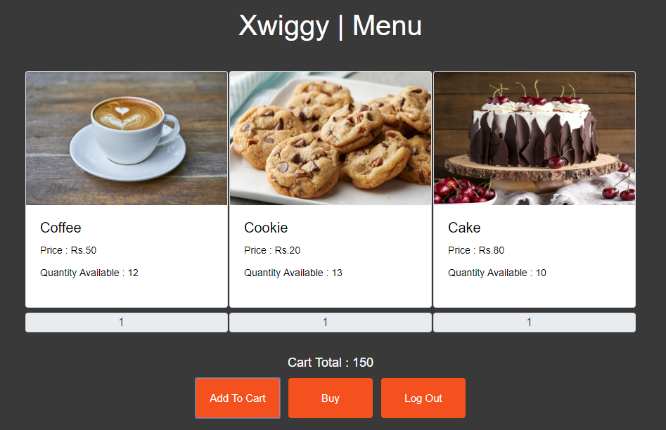

# Xwiggy
Food Ordering System

# About Project
Xwiggy is a normal food ordering system which implements the MVC (Model-View-Control) Architecture. <br>
As View, Angular-8 with routing is used. For the backend, Spring Boot v2.1.6 is used. For the Database Support, MySql has been used.
Java Persistence Api (JPA) is used to write the Business Logic. REST Api's are written to communicate between server ports 
(Angular-> port:4200, SpringBoot -> port:8080, MySql -> port:3306)

The project consist of a Login and Register page when user navigates to localhost:4200. On successfull login or Registration, a welcome page 
all the user details and option to order your food. The Menu page list all the available items in database with their available quantity.
When items are added to cart and navigated to payment page, it asks for card details. On clicking the pay now option, the purchased quantity
get's seperated from DB as well as Menu component.

# Pre-Requisite
1. [Java 7 or Above](https://java.com/en/download/help/download_options.xml) installed on device
2. MySQL Server
3. NodeJS - npm

## Installation
Clone the [git](https://github.com/3point141/Xwiggy-Angular8-SpringBoot-MVC-JPA-MYSQL) repository to use Xerminal.

```
git clone https://github.com/3point141/Xwiggy-Angular8-SpringBoot-MVC-JPA-MYSQL.git
```
| project | Functionality |
|----|-------|
| xwiggy-app| Frontend |
| xwiggy-back | Backend |

## Run

1. Open xwiggy-app as a project
```
ng build
ng serve
```
This will start your server for frontend at http://localhost:4200
<br>
2. Open xwiggy-back as a project
```
Start MySql Server
Run src/main/resources/dbScripts/ddl.sql
```
This will create the database "myusers" at your MySql Server running at http://localhost:3306
If you have configured the MySql server address to some other port, you can change that url in Application.properties file.<br>
Location : src/main/resources/application.properties

```
Run src/main/java/com/xwiggy/food/XwiggyApplication.java
```
This will fire up the Spring Boot at http://localhost:8080

## Rest Api's
| Url Mapping | Type | Function |
|----|---|---|
| /login | POST | Takes Login Model objects, Validates, Returns User model object |
| /login | GET | Returns new Login model object |
| /register | POST | Accepts User model object for registration, Returns User model object|
| /register | GET | Returns new User model object |
| /checkUserName | Post | Accepts String username, Returns Boolean is exist or not |
| /menu | GET | Return List of Food model object |
| /cart | POST | Accepts Cart model object, Return Integer total of all products purchased |
| /changeDB | GET | Return Boolean if DB gets updated after a purchase is made |

## Working Screenshots
<table>
  <tr>
    <td></td>
    <td></td>
  </tr>
  <tr>
    <td></td>
    <td></td>
  </tr>
  <tr>
    <td></td>
    <td></td>
  </tr>
 </table>
 <div class="center">
    
 </div>

## Author 
Aman Kumar - [3point141](https://github.com/3point141)
