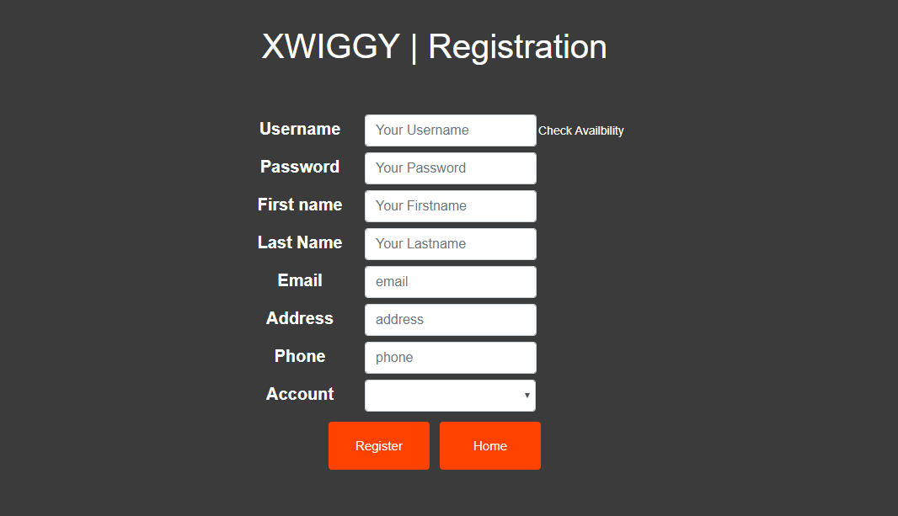
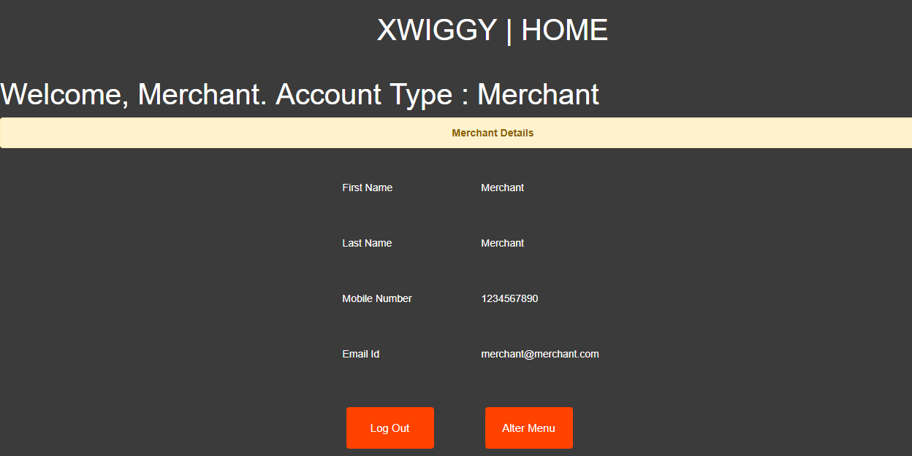

# Xwiggy
Food Ordering System

# About Project
Xwiggy is a normal food ordering system which implements the MVC (Model-View-Control) Architecture. <br>
As View, Angular-8 with routing is used. For the backend, Spring Boot v2.1.6 is used. For the Database Support, MySql has been used.
Java Persistence Api (JPA) is used to write the Business Logic. REST Api's are written to communicate between server ports 
(Angular-> port:4200, SpringBoot -> port:8080, MySql -> port:3306)

The project consist of a Login and Register page when user navigates to localhost:4200. On successfull login or Registration as a user, a welcome page 
all the user details and option to order your food. The Menu page list all the available items in database with their available quantity.
When items are added to cart and navigated to payment page, it asks for card details. On clicking the pay now option, the purchased quantity get's seperated from DB as well as Menu component.

Similarly, when a person logins or registers as a merchant, a page with the merchant details appers with an option to alter the menu. If a merchant add the quantity a post request is made and the DB updates itself. The component refreshes itself and the page doesn't need to refresh to see the changes.

# Pre-Requisite
1. [Java 7 or Above](https://java.com/en/download/help/download_options.xml) installed on device
2. MySQL Server
3. NodeJS - npm

## Installation
Clone the [git](https://github.com/3point141/Xwiggy-Angular8-SpringBoot-MVC-JPA-MYSQL) repository to use Xwiggy.

```
git clone https://github.com/3point141/Xwiggy-Angular8-SpringBoot-MVC-JPA-MYSQL.git
```
| project | Functionality |
|----|-------|
| xwiggy-app| Frontend |
| xwiggy-back | Backend |

## Run on Host Machine

1. Open xwiggy-app as a project
```
ng build
ng serve
```
This will start your server for frontend at http://localhost:4200
<br>
2. Open xwiggy-back as a project
```
Start MySql Server
Run src/main/resources/dbScripts/ddl.sql
```
This will create the database "myusers" at your MySql Server running at http://localhost:3306
If you have configured the MySql server address to some other port, you can change that url in Application.properties file.<br>
Location : src/main/resources/application.properties

```
Run src/main/java/com/xwiggy/food/XwiggyApplication.java
```
This will fire up the Spring Boot at http://localhost:8080

## Run using Vargant Box
Find the Vagrant file in [Vagrant Resources](https://github.com/3point141/Xwiggy-Angular8-SpringBoot-MVC-JPA-MYSQL/tree/master/Vagrant%20Resources) <br>
The folder also consist of shell script whill will help to install the dependencies in virtual machine at time of boot up.<br>

1. Download [Oracle Virtual Box](https://www.virtualbox.org/wiki/Downloads) and install it on your host machine. <br><br>
2. Download [Vagrant Box](https://www.vagrantup.com/downloads.html) by HashiCorp and install it on your host machine <br>
Navigate to vagrant file location and fire up your Terminal/Cmd
```
vagrant up
```
This will make your virtual machine in oracle virtual box or any service prover for vm with specifications :

Specification | Description 
 --- | --- 
 Operating System | ubuntu/trusty64(x64) v20190429.0.1 
 Base Memory | 512 MB 

These services will automatically be installed via shell script :white_check_mark:

~~~
* npm - 6.4.1 
* node - v10.14.0 
* MySql server
~~~
***Password for MySQL will be abcd1234***

3. Take the jar file from [here](https://github.com/3point141/Xwiggy-Angular8-SpringBoot-MVC-JPA-MYSQL/tree/master/FinalBuild) and place it in the vagrant file location. <br>

4. Importing the mySql script from [here](https://github.com/3point141/Xwiggy-Angular8-SpringBoot-MVC-JPA-MYSQL/tree/master/Vagrant%20Resources) to Vagrant box. SSH the Vagrant box via terminal/cmd at the location of vagrant file
```
vagrant ssh
sudo mysql -u root -p
create database myusers
exit
```

5. Installing JDK. In the same terminal where the ssh was done to Vagrant Box run the following command
```
sudo add-apt-repository ppa:openjdk-r/ppa -y
sudo apt-get update
sudo apt-get -y install openjdk-8-jdk
```
This will install Java for running the JAR file. <br>
<br>

6. Editing Host file.<br>
For Windows user
```
c:\Windows\System32\Drivers\etc\hosts
```
Edit file as Administrator. Add this line in the end
```
192.168.33.10 vgdemo.local www.xwiggy.com 
```
***vgdemo is the name of folder where vagrant file and box is kept***

7. Running the JAR file inside Vagrant Box
```
cd /var/www/html/
java -jar xwiggy-0.0.1-SNAPSHOT.jar
```
8. open browser and navigate to http://xwiggy.com:8080 <br />
9. Enjoy :relieved:

## Rest Api's
| Url Mapping | Type | Function |
|----|---|---|
| /login | POST | Takes Login Model objects, Validates, Returns User model object |
| /login | GET | Returns new Login model object |
| /register | POST | Accepts User model object for registration, Returns User model object|
| /register | GET | Returns new User model object |
| /checkUserName | Post | Accepts String username, Returns Boolean is exist or not |
| /menu | GET | Return List of Food model object |
| /cart | POST | Accepts Cart model object, Return Integer total of all products purchased |
| /changeDB | GET | Return Boolean if DB gets updated after a purchase is made |

## Working Screenshots
<table>
  <tr>
    <td></td>
    <td></td>
  </tr>
  <tr>
    <td></td>
    <td></td>
  </tr>
  <tr>
    <td></td>
    <td></td>
  </tr>
  <tr>
    <td></td>
    <td></td>
  </tr>
 </table>
 <div class="center">
    
 </div>

## Author 
Made with :heart: by Aman Kumar - [3point141](https://github.com/3point141)

:zap: This project is in very early stage. Some bugs can be noticed very frequently. Feel free to test is and report the bugs. 
